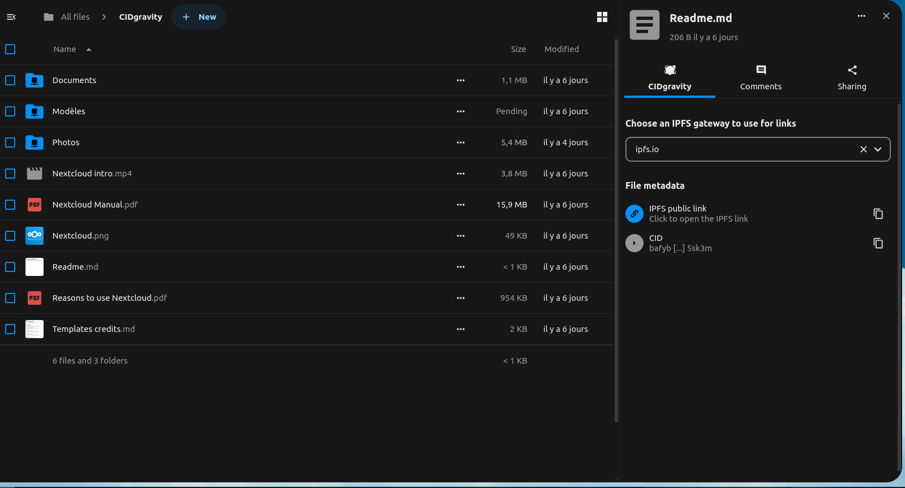

# CIDgravity gateway

This Nextcloud app allows to retrieve files and folder metadata on decentralized web using CIDgravity gateway services.
Access a new tab for file details to view additional information about the file on IPFS.

## A simple app to retrieve files and folder from decentralized web



## Requirements
* Nextcloud 29

## Installation
### Automatic installation (*recommended*)
~~Just install it from your Nextcloud application catalogue.~~ Not available (yet)

### Manual installation (from releases)
* Download the latest version from the [release page](https://github.com/CIDgravity/nextcloud-cidgravity-gateway-app/releases/latest).
* Extract the archive to your Nextcloud's app folder, e.g. `unzip cidgravity_gateway-vx.x.x.zip -C /path/to/nextcloud/apps`
* Enable the app in the Apps section of your Nextcloud.

### Manual installation (from repository)
* Simply clone the repo to your apps folder and build the frontend:

```
cd /path/to/nextcloud/apps/
git clone https://github.com/CIDgravity/nextcloud-cidgravity-gateway-app.git
cd nextcloud-cidgravity-gateway-app/
make composer
make npm-init
make build-js-production
```

* Enable the app in the Apps section of your Nextcloud.
